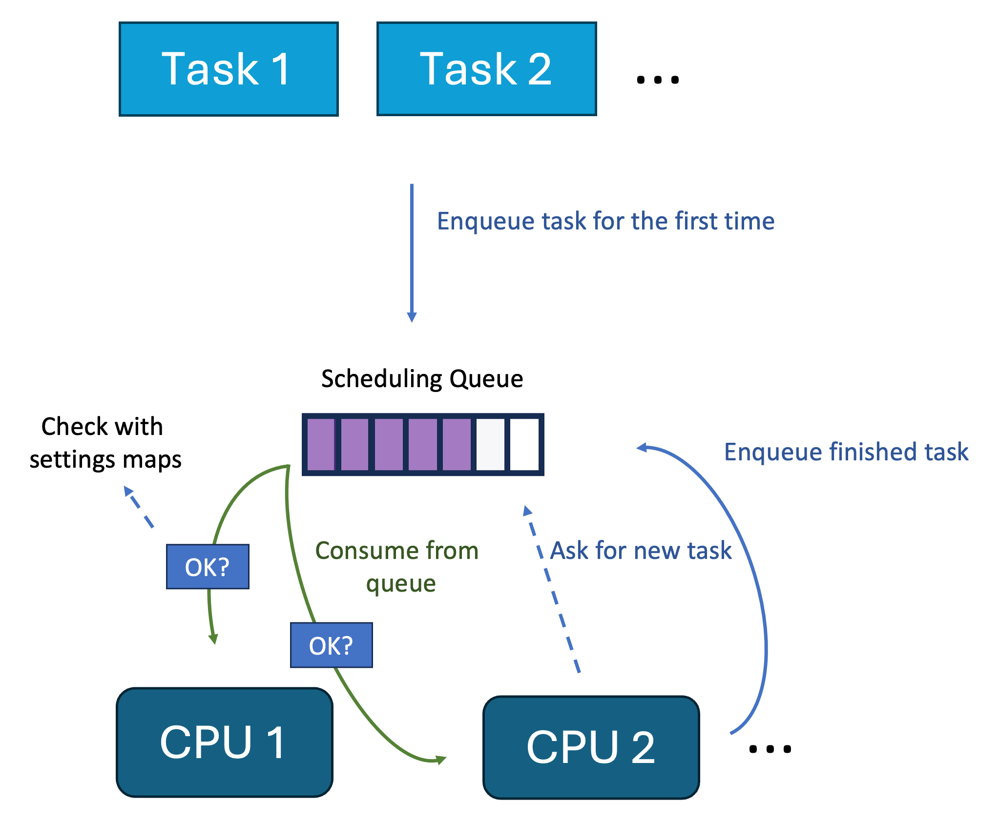

Taskcontrol
===========

Ever wanted to control which tasks are scheduled on your system via a neat API?
This project is for you!

## Usage

```sh
./scheduler.sh
```

Then use the following APIs:

```
GET localhost:8087/help prints you this help
GET localhost:8087/task/{id} to get the status of a task
GET localhost:8087/task/{id}?stopping=true|false to stop or resume a task
GET localhost:8087/taskGroup/{id} to get the status of a task group (i.e. process)
GET localhost:8087/taskGroup/{id}?restartstopping=true|false to stop or resume a task group
```

You can select multiple schedulers via `./scheduler.sh` or set the server port:

```sh
Usage: scheduler [-hV] [-p=<port>] [-s=<schedulerType>]
A FIFO scheduler with a rest API to stop tasks
  -h, --help          Show this help message and exit.
  -p, --port=<port>   The port to listen on
  -s, --scheduler=<schedulerType>
                      The scheduler to use: fifo
  -V, --version       Print version information and exit.
```

Currently only the FIFO scheduler is implemented.

## Example

Start the scheduler at the default port 8087:
```sh
./scheduler.sh
```

In another terminal start a task, e.g. the Ticker Java program which prints `Tick n` every second:
```sh
java samples/Ticker.java &
```
Now take the PID of the Ticker program and stop it via the API:
```sh
curl "localhost:8087/taskGroup/$(pgrep -f Ticker)?stopping=true"
```
It should now stop being rescheduled and therefore stop emitting `Tick n`.

You can resume it via:
```
curl "localhost:8087/taskGroup/$(pgrep -f Ticker)?stopping=false"
```

## Java Example

See [Main.java](src/main/java/me/bechberger/taskcontrol/Main.java) for an example on how to use the scheduler in Java.

```java
Thread clockThread = new ClockThread();
clockThread.start();
ThreadControl threadControl = new ThreadControl();
threadControl.stopThread(clockThread);
System.out.println("ClockThread status: " + threadControl.getThreadStatus(clockThread));
Thread.sleep(10000);
threadControl.resumeThread(clockThread);
```

## Implementation

The scheduler consists of two parts:

- The scheduler server
  - runs with root privileges
  - starts the scheduler
  - opens a server with an HTTP API (implemented with Javalin)
- The client in Java
  - allows to directly interact with the scheduler on Java thread level

The schedulers basically check every time they want to schedule a
task whether the task is stopped or not:



## Install

Install a 6.12 kernel

On Ubuntu:

```sh
sudo add-apt-repository ppa:canonical-kernel-team/unstable
```

And replace `oracular` with `plucky` in `/etc/apt/sources.list.d/canonical-kernel-team-ubuntu-unstable-oracular.sources`.
Then run:

```sh
sudo apt update
sudo apt install linux-cloud-tools-6.12.0-3-generic
```

Get a current version of bpftool by downloading it from [GitHub](https://github.com/libbpf/bpftool/releases)
and storing the location of the binary in `$PROJECT/.bpftool.path`.

You should also have install:

- `libbpf-dev`
- clang
- Java 23

Now you just have to build it via:

```sh
mvn package
```

License
=======
GPLv2